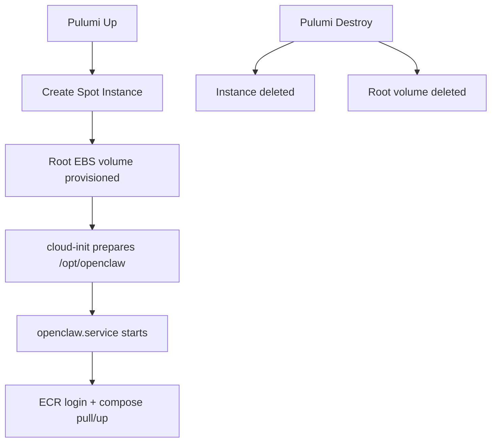

# OpenClaw EC2 Spot Architecture Notes

This document explains data/secret lifecycle behavior for the `ec2-spot` stack.

## Current Behavior (as implemented)

- The root EBS volume (size controlled by `root_volume_size_gib`) is used for persistent storage; `/opt/openclaw` lives on the root filesystem.
- Runtime artifacts under `/opt/openclaw` are persisted, including:
  - `docker-compose.yaml`
  - `.openclaw/` state
  - `auto-approve-devices.sh` helper script
- Runtime secrets are generated at service start under `/run/openclaw/.env`.
- CloudWatch agent is installed and configured for log collection and metrics monitoring.
- S3 snapshot-based backup/restore keeps `/opt/openclaw/.openclaw` mirrored in a platform-managed bucket.
  - Boot restore runs from `s3://bucket/latest/` before `openclaw.service` starts.
  - A systemd timer creates timestamped snapshots and updates `latest/` every 20 minutes.
  - Lifecycle policy runs daily to enforce tiered retention rules.
  - Backup/restore logs are collected in CloudWatch Logs.
- **Bootstrap scripts** (backup/restore/lifecycle/auto-approve/docker-compose/cloudwatch config) are uploaded automatically by the **platform** Pulumi stack into the scripts bucket and fetched during cloud-init; no manual S3 uploads are required.

## S3 Snapshot-Based Backups & Lifecycle Management

### Snapshot Structure

The S3 backup bucket uses a snapshot-based architecture for atomic point-in-time recovery:

```
s3://openclaw-lab-backup-<stack>-<account-id>/
├── latest/                     # Always contains most recent backup (fast boot restore)
│   └── .openclaw/*
└── snapshots/
    ├── 2026-02-27-14-00/      # Timestamped snapshots (YYYY-MM-DD-HH-MM UTC)
    │   └── .openclaw/*
    ├── 2026-02-27-13-00/
    │   └── .openclaw/*
    └── 2026-02-26-14-00/
        └── .openclaw/*
```

**Benefits over S3 versioning:**
- **Atomic snapshots**: All files captured together at a specific timestamp
- **Simple restoration**: Copy entire snapshot folder → instant state recovery
- **Clear retention**: Delete entire snapshots older than policy allows
- **Lower cost**: Only keep full snapshots, not per-file version history

### Backup Frequency

Backups run every **20 minutes** via systemd timer (`openclaw-s3-backup.timer`):
1. Create timestamped snapshot: `s3://bucket/snapshots/YYYY-MM-DD-HH-MM/`
2. Update `latest/`: Sync current state to `s3://bucket/latest/` (with `--delete`)

### Tiered Retention Policy

Automated lifecycle management runs **daily** via systemd timer (`openclaw-s3-lifecycle.timer`):

| Age Range | Retention Rule | Example |
|-----------|----------------|---------|
| **< 24 hours** | Keep all hourly snapshots | All snapshots from today |
| **24h - 7 days** | Keep only 00:00 UTC daily snapshots | One snapshot per day at midnight |
| **7 days - 30 days** | Keep only Friday 00:00 UTC snapshots | One snapshot per week (Friday) |
| **> 30 days** | Delete all snapshots | Expire old backups |
| **`latest/`** | Always preserved | Never deleted by lifecycle policy |

**Implementation**: Pure Python script with boto3 (`/usr/local/bin/openclaw-s3-lifecycle.py`)
- Testable logic separated from AWS API calls
- Unit tests verify retention calculations
- Runs at boot + daily + on-demand

### Restore Scenarios

**1. Normal boot (automatic):**
```bash
# Happens automatically via cloud-init
# Restores from s3://bucket/latest/
```

**2. Restore from specific snapshot:**
```bash
# SSH into instance
sudo aws s3 sync s3://openclaw-lab-backup-dev-123456/snapshots/2026-02-27-11-00/ \
  /opt/openclaw/.openclaw/ --region us-east-1 --delete

# Restart OpenClaw service
sudo systemctl restart openclaw.service
```

**3. List available snapshots:**
```bash
aws s3 ls s3://openclaw-lab-backup-dev-123456/snapshots/ --recursive --region us-east-1
```

**4. Manual lifecycle policy run:**
```bash
# Dry run (see what would be deleted)
sudo /usr/local/bin/openclaw-s3-lifecycle.py \
  --bucket openclaw-lab-backup-dev-123456 \
  --region us-east-1 \
  --dry-run

# Actual run (delete expired snapshots)
sudo /usr/local/bin/openclaw-s3-lifecycle.py \
  --bucket openclaw-lab-backup-dev-123456 \
  --region us-east-1
```

### Consistency Guard (Systemd Ordering)

The backup service uses systemd dependencies to ensure basic consistency:

- `After=openclaw.service`: Backup doesn't run until OpenClaw service is started
- `PartOf=openclaw.service`: Backup service is stopped if OpenClaw service is stopped/restarted
- **Result**: Backups only occur when the OpenClaw service is actively running

**Limitations:**
- This approach does **not** prevent concurrent writes during the 20-minute backup cycle
- OpenClaw's internal file consistency mechanisms are relied upon for data integrity
- For high-write workloads or strict consistency requirements, consider adding explicit file locks (not yet implemented)

**Future enhancement**: Implement `.openclaw/.sync-in-progress` lock file or brief service pause during backup.

## Data vs Secret persistence boundary

`.env` is not persisted on disk; it is re-hydrated into `/run/openclaw/.env`.

### Recommended split

- Persisted on root EBS volume:
  - `/opt/openclaw/.openclaw`
  - `/opt/openclaw/workspace`
- Ephemeral/root/tmpfs:
  - `/run/openclaw/.env` (or `/var/lib/openclaw/runtime/.env` on root EBS)

This keeps state durable while reducing secret persistence on disk.

## Lifecycle use cases

## 1) Fast ephemeral lab (lowest complexity)

- Everything reconstructed from source + SSM on boot
- Lowest cost, lowest recovery fidelity

## 2) S3 backup (recommended)

- Restore from S3 on boot
- Periodic sync to S3 via systemd timer
- Predictable DR workflow using the S3 bucket as the source of truth

## Visual model



```text
Recommended path split

/opt/openclaw                 -> persistent root filesystem
  /.openclaw                  -> durable state
  /workspace                  -> durable workspace

/run/openclaw/.env            -> ephemeral secret material (re-fetched at boot/start)
```


## Decisions

- `.env` is always re-fetched (stricter secret hygiene).
- Deterministic AZ pinning is required in Pulumi config.
- Spot-price discovery is handled outside Pulumi via `make ec2-spot-prices INSTANCE_TYPES="..."`.

## Runbook

### 1) Choose instance type and AZ

Inspect spot prices first:

```bash
make ec2-spot-prices INSTANCE_TYPES="t4g.small t4g.medium" REGION=me-central-1
```

Then configure the stack:

```bash
cd ec2-spot
pulumi config set instance_type t4g.small
pulumi config set availability_zone me-central-1a
# optionally adjust the root volume size (default 15 GiB)
# pulumi config set root_volume_size_gib 20
```

### 2) Deploy or redeploy

The instance boots, runs cloud-init and automatically restores any data
present in the S3 backup bucket before starting OpenClaw.  No extra
config is required:

```bash
cd ec2-spot
pulumi up
```

If you wish to start from an empty state, make sure the S3 bucket is
empty or disabled before provisioning.

### 3) Restore from backup

Any data previously synced to the bucket will be fetched on boot.  To
perform a selective recovery you can:

```bash
# copy objects from your recovery bucket to the active bucket
aws s3 sync s3://my-archive-bucket/ s3://openclaw-backup-<stack>/ --region me-central-1
# then reboot or reprovision the instance
```

### 4) Destroying the stack

Simply run the normal destroy; the root volume is deleted.  Persistent
state lives in the S3 bucket, so no further action is required.  If you
want a final copy, perform an `aws s3 sync` before tearing down.

```bash
cd ec2-spot
pulumi destroy
```


