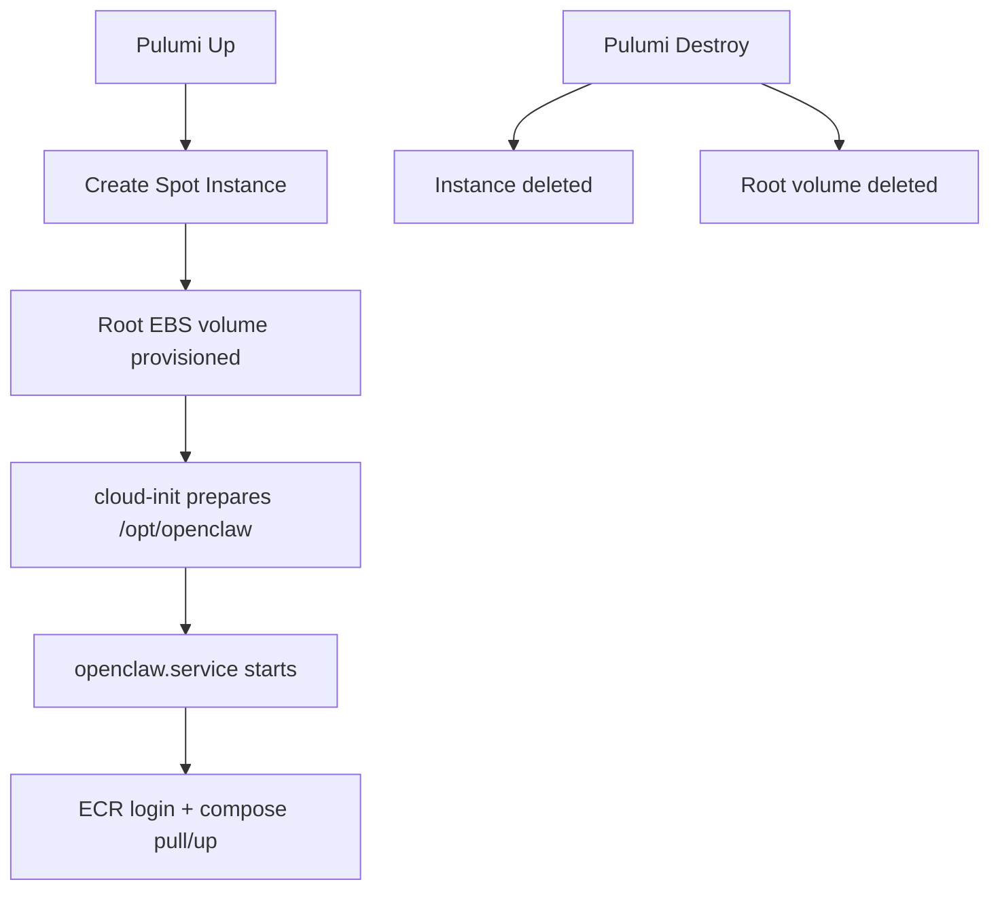

# OpenClaw EC2 Spot Architecture Notes

This document explains data/secret lifecycle behavior for the `ec2-spot` stack.

## Current Behavior (as implemented)

- The root EBS volume (size controlled by `root_volume_size_gib`) is used for persistent storage; `/opt/openclaw` lives on the root filesystem.
- Runtime artifacts under `/opt/openclaw` are persisted, including:
  - `docker-compose.yaml`
  - `.openclaw/` state
  - `auto-approve-devices.sh` helper script
- Runtime secrets are generated at service start under `/run/openclaw/.env`.
- CloudWatch agent is installed and configured for log collection and metrics monitoring.
- S3 sync backup/restore keeps `/opt/openclaw/.openclaw` mirrored in a platform-managed bucket.
  - Boot restore runs before `openclaw.service` starts.
  - A systemd timer syncs back to S3 every 20 minutes.
  - Backup/restore logs are collected in CloudWatch Logs.

## Data vs Secret persistence boundary

`.env` is not persisted on disk; it is re-hydrated into `/run/openclaw/.env`.

### Recommended split

- Persisted on root EBS volume:
  - `/opt/openclaw/.openclaw`
  - `/opt/openclaw/workspace`
- Ephemeral/root/tmpfs:
  - `/run/openclaw/.env` (or `/var/lib/openclaw/runtime/.env` on root EBS)

This keeps state durable while reducing secret persistence on disk.

## Lifecycle use cases

## 1) Fast ephemeral lab (lowest complexity)

- Everything reconstructed from source + SSM on boot
- Lowest cost, lowest recovery fidelity

## 2) S3 backup (recommended)

- Restore from S3 on boot
- Periodic sync to S3 via systemd timer
- Predictable DR workflow using the S3 bucket as the source of truth

## Visual model



```text
Recommended path split

/opt/openclaw                 -> persistent root filesystem
  /.openclaw                  -> durable state
  /workspace                  -> durable workspace

/run/openclaw/.env            -> ephemeral secret material (re-fetched at boot/start)
```


## Decisions

- `.env` is always re-fetched (stricter secret hygiene).
- Deterministic AZ pinning is required in Pulumi config.
- Spot-price discovery is handled outside Pulumi via `make ec2-spot-prices INSTANCE_TYPES="..."`.

## Runbook

### 1) Choose instance type and AZ

Inspect spot prices first:

```bash
make ec2-spot-prices INSTANCE_TYPES="t4g.small t4g.medium" REGION=me-central-1
```

Then configure the stack:

```bash
cd ec2-spot
pulumi config set instance_type t4g.small
pulumi config set availability_zone me-central-1a
# optionally adjust the root volume size (default 15 GiB)
# pulumi config set root_volume_size_gib 20
```

### 2) Deploy or redeploy

The instance boots, runs cloud-init and automatically restores any data
present in the S3 backup bucket before starting OpenClaw.  No extra
config is required:

```bash
cd ec2-spot
pulumi up
```

If you wish to start from an empty state, make sure the S3 bucket is
empty or disabled before provisioning.

### 3) Restore from backup

Any data previously synced to the bucket will be fetched on boot.  To
perform a selective recovery you can:

```bash
# copy objects from your recovery bucket to the active bucket
aws s3 sync s3://my-archive-bucket/ s3://openclaw-backup-<stack>/ --region me-central-1
# then reboot or reprovision the instance
```

### 4) Destroying the stack

Simply run the normal destroy; the root volume is deleted.  Persistent
state lives in the S3 bucket, so no further action is required.  If you
want a final copy, perform an `aws s3 sync` before tearing down.

```bash
cd ec2-spot
pulumi destroy
```


