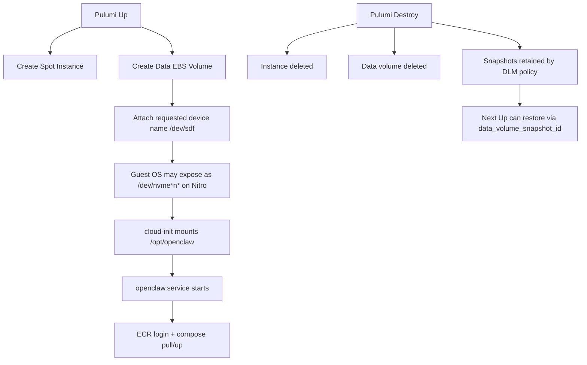

# OpenClaw EC2 Spot Architecture Notes

This document explains data/secret lifecycle behavior for the `ec2-spot` stack and proposes safer persistence patterns.

## Current Behavior (as implemented)

- The root EBS volume (size controlled by `root_volume_size_gib`) is used for persistent storage; `/opt/openclaw` lives on the root filesystem.
- Runtime artifacts under `/opt/openclaw` are persisted, including:
  - `docker-compose.yaml`
  - `.openclaw/` state
  - `auto-approve-devices.sh` helper script
- Runtime secrets are generated at service start under `/run/openclaw/.env`.
- Data volume is tagged for AWS DLM snapshots with retention controls (legacy).
- Volume lifecycle had been snapshot-first, but the workflow is being retired in favor of S3 backups.
- CloudWatch agent is installed and configured for log collection and metrics monitoring.
- S3 sync backup/restore now keeps `/opt/openclaw` mirrored in a platform-managed bucket.
  - Boot restore runs before `openclaw.service` starts.
  - A systemd timer syncs back to S3 every 20 minutes.
  - Backup/restore logs are collected in CloudWatch Logs.

## Snapshot-first model (legacy)

This strategy was previously supported but is now deprecated in favor of S3 sync backups:

- DLM snapshots were tagged OpenClaw data volumes on a schedule.
- Retention policy cleaned up older snapshots automatically.
- `pulumi destroy` caused data volume deletion; recovery required a snapshot ID.
- Future work will remove this pattern once S3 backup proves reliable.

This avoids orphaned retained volumes and keeps recovery explicit.

## `snapshot_on_delete` expectation

There is no direct EBS "snapshot on delete" toggle in this stack.

- Equivalent outcome is achieved by scheduled DLM snapshots + retention.
- For guaranteed final snapshot before destroy, use an explicit pre-destroy runbook step.

## Snapshot cost note

EBS snapshots are incremental at block level.

- First snapshot stores full used blocks.
- Later snapshots store changed blocks.
- Cost still grows with churn and retention duration, but multiple snapshots are usually manageable if retention is controlled.

## Data vs Secret persistence boundary

`.env` is not persisted on the data volume; it is re-hydrated into `/run/openclaw/.env`.

### Recommended split

- Persisted volume (EBS):
  - `/opt/openclaw/.openclaw`
  - `/opt/openclaw/workspace`
- Ephemeral/root/tmpfs:
  - `/run/openclaw/.env` (or `/var/lib/openclaw/runtime/.env` on root EBS)

This keeps state durable while reducing secret persistence in retained volumes/snapshots.

## Lifecycle use cases

## 1) Fast ephemeral lab (lowest complexity)

- No retained volume or snapshots
- Everything reconstructed from source + SSM on boot
- Lowest cost, lowest recovery fidelity

## 2) Retained volume + manual reattach (alternative)

- Keep volume on destroy
- Manually reattach/import when needed
- Good for ad hoc continuity, but easy to drift/orphan

## 3) Snapshot-first restore (recommended baseline)

- Keep deployment stateless-ish
- Take periodic snapshots of data volume
- Recreate volume from latest snapshot for recovery
- Predictable DR workflow with controlled retention

## 4) Scheduled backups with DLM (recommended automation)

- DLM policy snapshots tagged data volumes on schedule
- Retention count/time limits control cost
- Restore path: choose snapshot -> create volume -> attach -> boot

## Visual model



```text
Recommended path split

/opt/openclaw                 -> persistent EBS mount
  /.openclaw                  -> durable state
  /workspace                  -> durable workspace

/run/openclaw/.env            -> ephemeral secret material (re-fetched at boot/start)
```


## Decisions

- `.env` is always re-fetched (stricter secret hygiene).
- Recovery target is scheduled snapshots (baseline, with possibility for smarter OpenClaw-native backups later).
- Deterministic AZ pinning is required in Pulumi config.
- Spot-price discovery is handled outside Pulumi via `make ec2-spot-prices INSTANCE_TYPES="..."`.

## Runbook

### 1) Choose instance type and AZ

Inspect spot prices first:

```bash
make ec2-spot-prices INSTANCE_TYPES="t4g.small t4g.medium" REGION=me-central-1
```

Then configure the stack:

```bash
cd ec2-spot
pulumi config set instance_type t4g.small
pulumi config set availability_zone me-central-1a
# optionally adjust the root volume size (default 15 GiB)
# pulumi config set root_volume_size_gib 20
```

### 2) Deploy or redeploy

The instance boots, runs cloud-init and automatically restores any data
present in the S3 backup bucket before starting OpenClaw.  No manual
snapshot or extra config is required:

```bash
cd ec2-spot
pulumi up
```

If you wish to start from an empty state, make sure the S3 bucket is
empty or disabled before provisioning.

### 3) Restore from backup

Any data previously synced to the bucket will be fetched on boot.  To
perform a selective recovery you can:

```bash
# copy objects from your recovery bucket to the active bucket
aws s3 sync s3://my-archive-bucket/ s3://openclaw-backup-<stack>/ --region me-central-1
# then reboot or reprovision the instance
```

### 4) Destroying the stack

Simply run the normal destroy; the root volume is deleted.  Persistent
state lives in the S3 bucket, so no further action is required.  If you
want a final copy, perform an `aws s3 sync` before tearing down.

```bash
cd ec2-spot
pulumi destroy
```


### 5) Verify DLM policy + retention

```bash
aws dlm get-lifecycle-policies --region me-central-1 --state ENABLED --query 'Policies[*].[PolicyId,Description,State]' --output table
```

### 6) Optional cleanup of manual snapshots

List manual final snapshots:

```bash
aws ec2 describe-snapshots \
  --region me-central-1 \
  --owner-ids self \
  --filters Name=tag:CreatedBy,Values=manual-final \
  --query 'Snapshots[*].[StartTime,SnapshotId,Description]' \
  --output table
```

Delete one snapshot:

```bash
aws ec2 delete-snapshot --region me-central-1 --snapshot-id snap-xxxxxxxxxxxxxxxxx
```

### 7) Troubleshooting: `VolumeInUse` during `pulumi up`

Symptom:

```text
api error VolumeInUse: vol-... is already attached to an instance
```

What this means:
- Pulumi attempted to replace `aws:ec2:VolumeAttachment` and AWS rejected a second attach while the volume was still attached.

Current mitigation in code:
- `VolumeAttachment` is configured with `delete_before_replace=True`.

Operational recovery steps:

```bash
cd ec2-spot
pulumi refresh
pulumi up
```

If still blocked, verify and detach stale attachment manually:

```bash
aws ec2 describe-volumes --region me-central-1 --volume-ids vol-xxxxxxxxxxxxxxxxx --query 'Volumes[0].Attachments' --output table
aws ec2 detach-volume --region me-central-1 --volume-id vol-xxxxxxxxxxxxxxxxx
```

Then run:

```bash
cd ec2-spot
pulumi up
```
