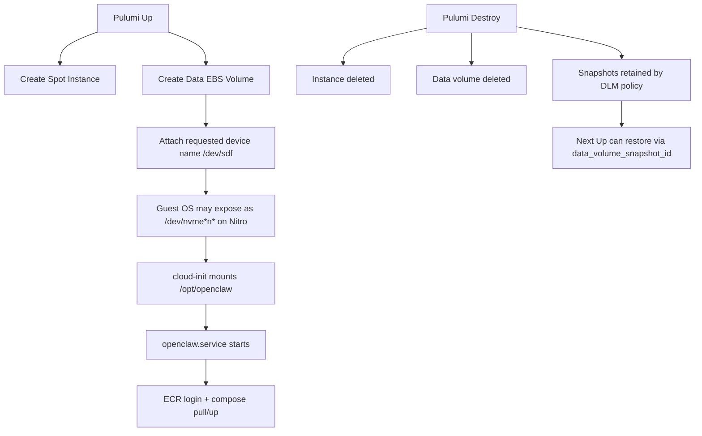

# OpenClaw EC2 Spot Architecture Notes

This document explains data/secret lifecycle behavior for the `ec2-spot` stack and proposes safer persistence patterns.

## Current Behavior (as implemented)

- A dedicated EBS volume is created and attached to the Spot instance.
- Cloud-init mounts that volume at `/opt/openclaw`.
- Runtime artifacts under `/opt/openclaw` are persisted, including:
  - `docker-compose.yaml`
  - `.openclaw/` state
  - `auto-approve-devices.sh` helper script
- Runtime secrets are generated at service start under `/run/openclaw/.env`.
- Data volume is tagged for AWS DLM snapshots with retention controls.
- Volume lifecycle is snapshot-first; data volume itself is not retained on destroy.
- CloudWatch agent is installed and configured for log collection and metrics monitoring.
- S3 sync backup/restore keeps `/opt/openclaw` mirrored in a platform-managed bucket.
  - Boot restore runs before `openclaw.service` starts.
  - A systemd timer syncs back to S3 every 20 minutes.
  - Backup/restore logs are collected in CloudWatch Logs.

## Snapshot-first model (current direction)

Current strategy:

- On schedule, DLM snapshots tagged OpenClaw data volumes.
- DLM retention policy deletes old snapshots automatically.
- On `pulumi destroy`, the data volume is deleted.
- For restore, set `data_volume_snapshot_id` and re-deploy.

This avoids orphaned retained volumes and keeps recovery explicit.

## `snapshot_on_delete` expectation

There is no direct EBS "snapshot on delete" toggle in this stack.

- Equivalent outcome is achieved by scheduled DLM snapshots + retention.
- For guaranteed final snapshot before destroy, use an explicit pre-destroy runbook step.

## Snapshot cost note

EBS snapshots are incremental at block level.

- First snapshot stores full used blocks.
- Later snapshots store changed blocks.
- Cost still grows with churn and retention duration, but multiple snapshots are usually manageable if retention is controlled.

## Data vs Secret persistence boundary

`.env` is not persisted on the data volume; it is re-hydrated into `/run/openclaw/.env`.

### Recommended split

- Persisted volume (EBS):
  - `/opt/openclaw/.openclaw`
  - `/opt/openclaw/workspace`
- Ephemeral/root/tmpfs:
  - `/run/openclaw/.env` (or `/var/lib/openclaw/runtime/.env` on root EBS)

This keeps state durable while reducing secret persistence in retained volumes/snapshots.

## Lifecycle use cases

## 1) Fast ephemeral lab (lowest complexity)

- No retained volume or snapshots
- Everything reconstructed from source + SSM on boot
- Lowest cost, lowest recovery fidelity

## 2) Retained volume + manual reattach (alternative)

- Keep volume on destroy
- Manually reattach/import when needed
- Good for ad hoc continuity, but easy to drift/orphan

## 3) Snapshot-first restore (recommended baseline)

- Keep deployment stateless-ish
- Take periodic snapshots of data volume
- Recreate volume from latest snapshot for recovery
- Predictable DR workflow with controlled retention

## 4) Scheduled backups with DLM (recommended automation)

- DLM policy snapshots tagged data volumes on schedule
- Retention count/time limits control cost
- Restore path: choose snapshot -> create volume -> attach -> boot

## Visual model



```text
Recommended path split

/opt/openclaw                 -> persistent EBS mount
  /.openclaw                  -> durable state
  /workspace                  -> durable workspace

/run/openclaw/.env            -> ephemeral secret material (re-fetched at boot/start)
```


## Decisions

- `.env` is always re-fetched (stricter secret hygiene).
- Recovery target is scheduled snapshots (baseline, with possibility for smarter OpenClaw-native backups later).
- Deterministic AZ pinning is required in Pulumi config.
- Spot-price discovery is handled outside Pulumi via `make ec2-spot-prices INSTANCE_TYPES="..."`.

## Runbook

### 1) Choose instance type + AZ before deployment

```bash
make ec2-spot-prices INSTANCE_TYPES="t4g.small t4g.medium" REGION=me-central-1
```

Then set stack config:

```bash
cd ec2-spot
pulumi config set instance_type t4g.small
pulumi config set availability_zone me-central-1a
```

### 2) Deploy fresh (no snapshot restore)

```bash
cd ec2-spot
pulumi config rm data_volume_snapshot_id || true
pulumi up
```

### 3) Restore from a snapshot

List candidate snapshots:

```bash
aws ec2 describe-snapshots \
  --region me-central-1 \
  --owner-ids self \
  --filters \
    Name=tag:OpenClawData,Values=true \
    Name=tag:OpenClawStack,Values=dev \
  --query 'Snapshots[*].[StartTime,SnapshotId,Tags[?Key==`OpenClawAz`]|[0].Value,State]' \
  --output table
```

Set restore snapshot and matching AZ, then deploy:

```bash
cd ec2-spot
pulumi config set data_volume_snapshot_id snap-xxxxxxxxxxxxxxxxx
pulumi config set availability_zone me-central-1a
pulumi up
```

Notes:
- The stack enforces AZ guardrails using snapshot tag `OpenClawAz`.
- If snapshot tag is missing/mismatched, `pulumi up` fails fast.

### 4) Safe destroy with an explicit final snapshot

Get current data volume ID:

```bash
cd ec2-spot
DATA_VOLUME_ID=$(pulumi stack output data_volume_id)
echo "$DATA_VOLUME_ID"
```

Create final manual snapshot before destroy:

```bash
aws ec2 create-snapshot \
  --region me-central-1 \
  --volume-id "$DATA_VOLUME_ID" \
  --description "openclaw final snapshot before destroy" \
  --tag-specifications 'ResourceType=snapshot,Tags=[{Key=OpenClawData,Value=true},{Key=OpenClawStack,Value=dev},{Key=OpenClawAz,Value=me-central-1a},{Key=CreatedBy,Value=manual-final}]'
```

Then destroy:

```bash
cd ec2-spot
pulumi destroy
```

### 5) Verify DLM policy + retention

```bash
aws dlm get-lifecycle-policies --region me-central-1 --state ENABLED --query 'Policies[*].[PolicyId,Description,State]' --output table
```

### 6) Optional cleanup of manual snapshots

List manual final snapshots:

```bash
aws ec2 describe-snapshots \
  --region me-central-1 \
  --owner-ids self \
  --filters Name=tag:CreatedBy,Values=manual-final \
  --query 'Snapshots[*].[StartTime,SnapshotId,Description]' \
  --output table
```

Delete one snapshot:

```bash
aws ec2 delete-snapshot --region me-central-1 --snapshot-id snap-xxxxxxxxxxxxxxxxx
```

### 7) Troubleshooting: `VolumeInUse` during `pulumi up`

Symptom:

```text
api error VolumeInUse: vol-... is already attached to an instance
```

What this means:
- Pulumi attempted to replace `aws:ec2:VolumeAttachment` and AWS rejected a second attach while the volume was still attached.

Current mitigation in code:
- `VolumeAttachment` is configured with `delete_before_replace=True`.

Operational recovery steps:

```bash
cd ec2-spot
pulumi refresh
pulumi up
```

If still blocked, verify and detach stale attachment manually:

```bash
aws ec2 describe-volumes --region me-central-1 --volume-ids vol-xxxxxxxxxxxxxxxxx --query 'Volumes[0].Attachments' --output table
aws ec2 detach-volume --region me-central-1 --volume-id vol-xxxxxxxxxxxxxxxxx
```

Then run:

```bash
cd ec2-spot
pulumi up
```
